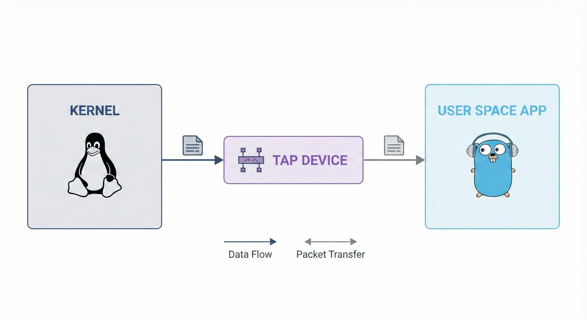

# mini-netstack

A simple, educational TCP/IP network stack written in Go (User Space).

I built `mini-netstack` to really understand how the internet works internally. Instead of letting the Linux Kernel handle everything, this project moves the packet processing logic to user space so we can see exactly what is happening with every byte.

It is not meant to replace your production stack, but it is a great way to see the inner workings of ARP, ICMP, UDP, and TCP.

## How it Works

The system hooks into a virtual TAP interface (`tap0`) to capture raw Ethernet frames. This lets the application act like an independent OS on the network, handling everything from Layer 2 up.



## Features

**Layer 2 (Link)**
- **TAP Driver**: Talks directly to `/dev/net/tun`.
- **Ethernet**: Decodes frames and MAC addresses.

**Layer 2.5 (Resolution)**
- **ARP**: Responds to "Who has 192.168.1.10?" so other devices can find us.

**Layer 3 (Network)**
- **IPv4**: Validates headers and handles basic routing.
- **ICMP**: Responds to Pings (Echo Request/Reply) with proper checksums.

**Layer 4 (Transport)**
- **UDP**: A simple Echo server that bounces data back to you.
- **TCP**: Implements the 3-way handshake (SYN -> SYN-ACK -> ACK), handles connections on port 80, and gracefully closes with FIN-ACK.

## Getting Started

### Prerequisites
- **Linux** (Needed for TAP interfaces)
- **Go 1.21+**
- `make` and `iproute2`

### Running it
The `Makefile` handles the setup (creating the interface, setting IPs, etc).

```bash
# Needs sudo to configure the network interface
make run
```

You should see something like:
```text
Interface tap0 ready.
I am 192.168.1.10 (MAC: 00:00:00:00:00:01)
Waiting for packets...
```

## Testing

Open a new terminal and try these out:

**1. Ping it**
```bash
ping 192.168.1.10
# Should see: 64 bytes from 192.168.1.10: icmp_seq=1 ttl=64...
```

**2. UDP Echo**
```bash
echo "Hello Netstack" | nc -u -w 1 192.168.1.10 8080
# Should return: (Echo) Hello Netstack
```

**3. TCP Connect**
```bash
nc -v 192.168.1.10 80
# Should see: Connection to 192.168.1.10 80 port [tcp/http] succeeded!
```

## Design Choices

Building a full TCP stack is a task that takes decades (RFC 793 is long 😅 ). To keep this manageable and educational, I made a few trade-offs:

- **No Congestion Control**: No sliding windows or retransmission timeouts. We assume the local network is reliable.
- **Fixed Sequence Numbers**: The Initial Sequence Number (ISS) is hardcoded to `1000` to make debugging easier (don't use this in production lol).
- **Single Threaded**: Everything runs in a main loop. Simple and easy to follow.

## Code Layout

- `cmd/netstack/`: The main application entrypoint and protocol handling logic.
- `pkg/device/`: Low-level TUN/TAP stuff.
- `pkg/frames/`: Ethernet frame parsing.
- `pkg/packets/`: The core logic (IP, TCP, UDP, ICMP).
- `pkg/utils/`: Checksum helpers.

## References

- [RFC 793 - TCP](https://tools.ietf.org/html/rfc793)
- [RFC 768 - UDP](https://tools.ietf.org/html/rfc768)
- Linux Kernel Networking

---
*Made with 💙 and Go.*